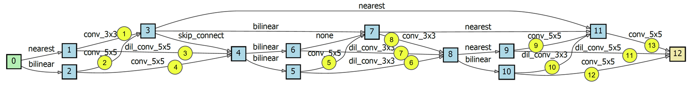
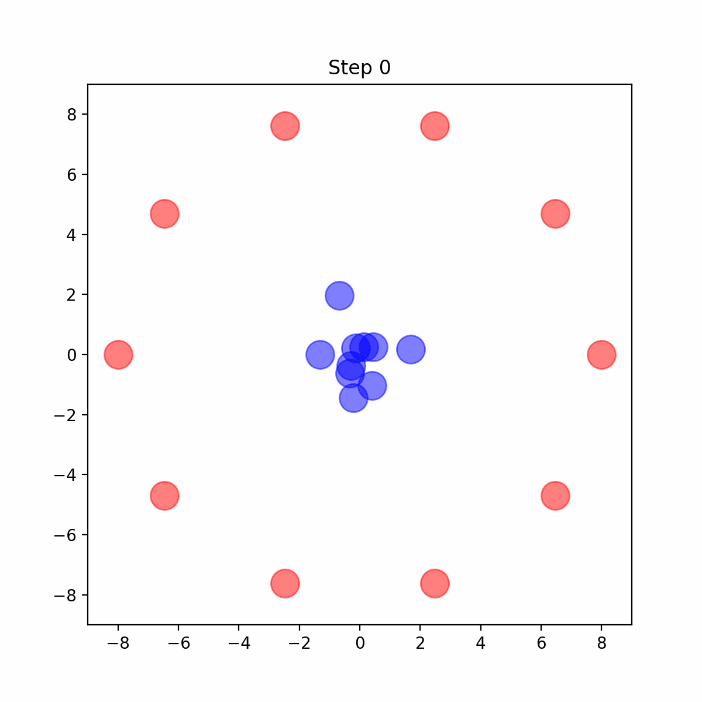
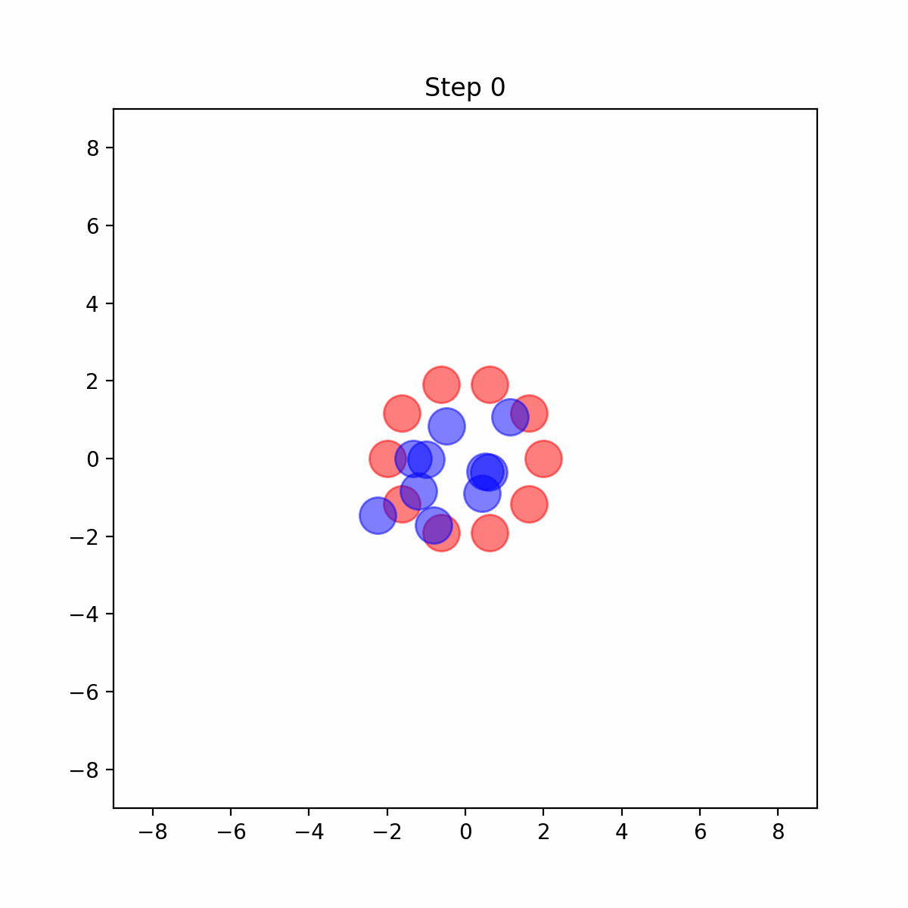
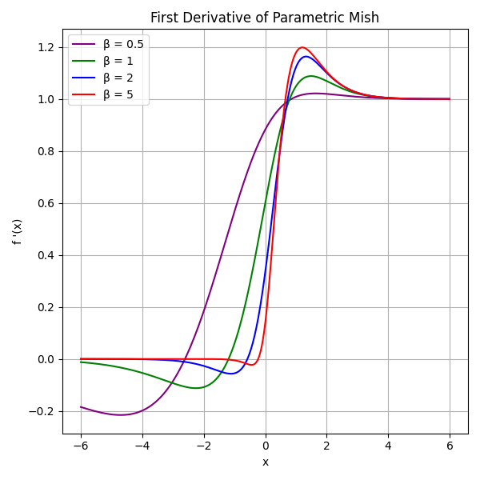
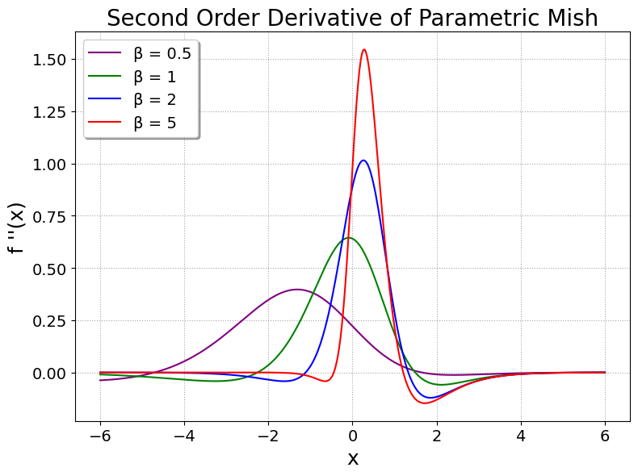

# Enhancing GANs with MMD Neural Architecture Search, PMish Activation Function, and Adaptive Rank Decomposition
This repository contains code for our ICASSP 2024 paper "Enhancing GANs with MMD Neural Architecture Search, PMish Activation Function and Adaptive Rank Decomposition." [[Website]](https://prasannapulakurthi.github.io/mmdnasplus/)

by [Prasanna Reddy Pulakurthi](https://prasannapulakurthi.com/), [Majid Rabbani](https://www.rit.edu/directory/mxreee-majid-rabbani), [Mahsa Mozaffari](https://mahsamozaffari.com/), [Sohail Dianat](https://www.rit.edu/directory/sadeee-sohail-dianat), [Jamison Heard](https://www.rit.edu/directory/jrheee-jamison-heard), and [Raghuveer Rao](https://ieeexplore.ieee.org/author/37281258600).

## Architecture

## Training Strategy

| Small Upper Bound | Large Upper Bound | Increasing Upper Bound (Proposed) |
| :---: | :---: | :---: |
| |  |  |

## Parametric Mish (PMish) Activation Function

| PMish | First-Order Derivative | Second-Order Derivative |
| :---: | :---: | :---: |
| |  |  |

## PMish Output Landscape
 

## Getting Started
### Installation
1. Clone this repository.

    ~~~
    git clone https://github.com/PrasannaPulakurthi/MMD-NAS-plus.git
    cd MMD-NAS-plus
    ~~~
   
2. Install requirements using Python 3.9.

    ~~~
    conda create -n mmd-nas python=3.9
    conda activate mmd-nas
    pip install -r requirements.txt
    ~~~
    
2. Install Pytorch1 and Tensorflow2 with CUDA.

    ~~~
    pip install torch==1.13.1+cu116 torchvision==0.14.1+cu116 torchaudio==0.13.1 --extra-index-url https://download.pytorch.org/whl/cu116
    ~~~
    To install other Pytroch versions compatible with your CUDA. [Install Pytorch](https://pytorch.org/get-started/previous-versions/)
   
    [Install Tensorflow](https://www.tensorflow.org/install/pip#windows-native)
   
### Preparing necessary files

Files can be found in [Google Drive](https://drive.google.com/drive/folders/1xB6Y-btreBtyVZ-kdGTIZgLTjsv7H4Pd?usp=sharing).

1. Download the pre-trained models to ./exps
    
2. Download the pre-calculated statistics to ./fid_stat for calculating the FID.

## Acknowledgement
Codebase from [AdversarialNAS](https://github.com/chengaopro/AdversarialNAS), [TransGAN](https://github.com/VITA-Group/TransGAN), and [Tensorly](https://github.com/tensorly/tensorly).
