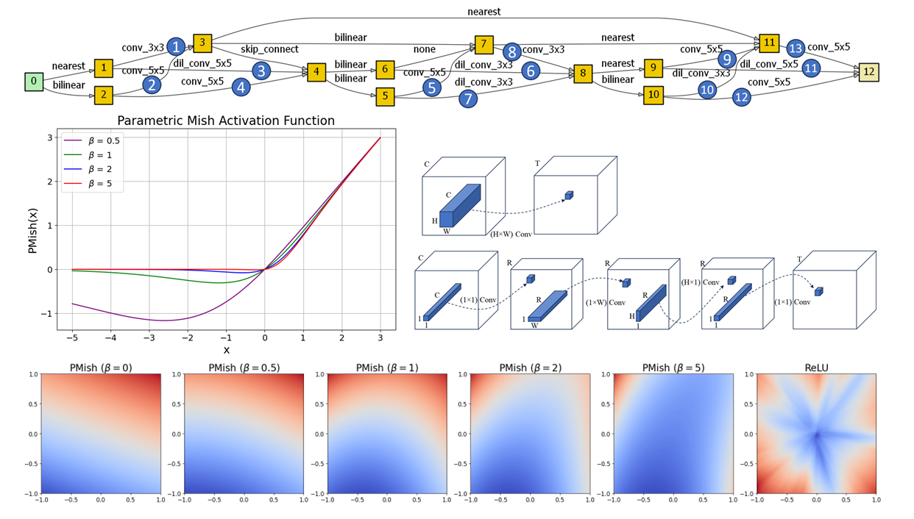
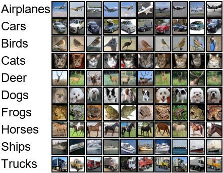
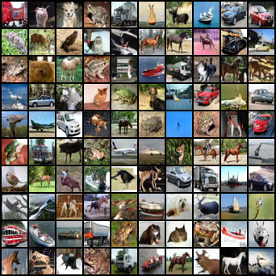
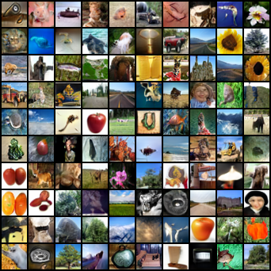
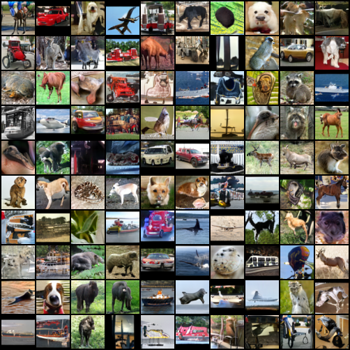
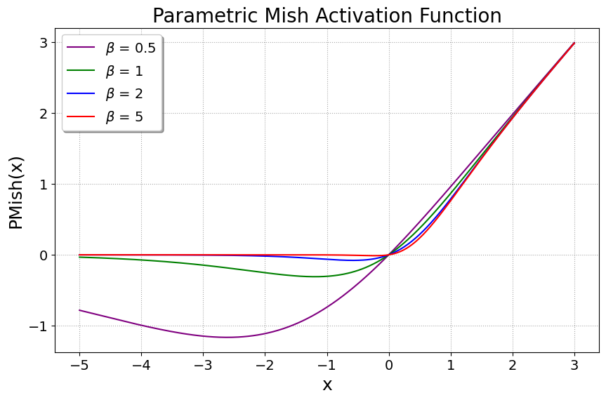
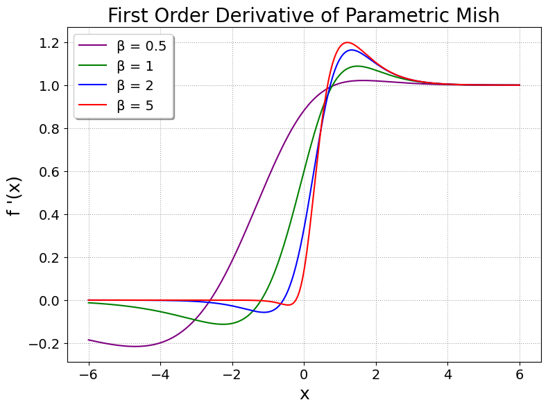
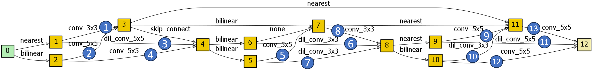
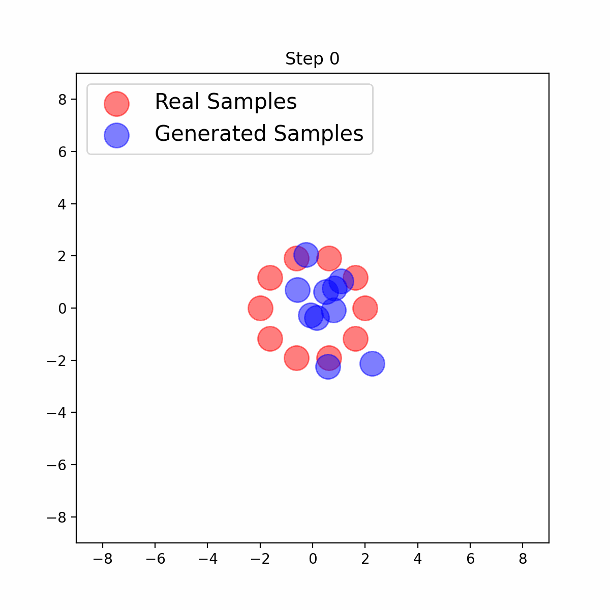

<p align="center">
     
</p>


## Enhancing GANs with MMD Neural Architecture Search, PMish Activation Function, and Adaptive Rank Decomposition [[Paper]](https://ieeexplore.ieee.org/document/10732016) [[Code]](https://github.com/PrasannaPulakurthi/MMD-NAS-Plus) [[Website]](https://prasannapulakurthi.github.io/MMD-PMish-NAS/) 

by [Prasanna Reddy Pulakurthi](https://prasannapulakurthi.com/), [Mahsa Mozaffari](https://mahsamozaffari.com/), [Sohail Dianat](https://www.rit.edu/directory/sadeee-sohail-dianat), [Jamison Heard](https://www.rit.edu/directory/jrheee-jamison-heard), [Raghuveer Rao](https://ieeexplore.ieee.org/author/37281258600), and [Majid Rabbani](https://www.rit.edu/directory/mxreee-majid-rabbani).

## Overview
This research enhances Generative Adversarial Networks (GANs) by introducing three key innovations: the **Parametric Mish (PMish)** activation function, a neural architecture search strategy that integrates **MMD-GAN repulsive loss** into the **AdversarialNAS** framework, and the **Adaptive Rank Decomposition (ARD)** method for model compression. Additionally, it improves the reliability of GAN convergence through a **Modified MMD-GAN repulsive loss**. Our approach achieves notable results on various datasets while maintaining a minimal computational footprint. The primary contributions include the **PMish activation function**, the **Modified MMD-GAN repulsive loss**, an optimized **training strategy**, and the **ARD** compression technique, which enables efficient deployment on resource-constrained devices.



## Image Generation Results
<p align="center"> [Watch the Results Video](https://youtu.be/yejnLOO2VaI) </p>


| CIFAR-10 (32x32) | CelebA (64x64) |
| :---: | :---: |
|  <br>  |  |

| CIFAR100 (32x32) | STL-10 (48x48) |
| :---: | :---: |
|  |  |

## Parametric Mish (PMish) Activation Function
Activation functions are essential in machine learning because they help models learn complex patterns in data. Popular ones like ReLU have a fixed shape, which might not always be optimal for every task. To solve this, we’ve developed a new activation function called Parametric Mish (PMish).

PMish stands out because it has built-in parameters that can adjust its shape as the model trains. This means it can change how smooth or sharp it is, finding the best fit for the task it's working on. By adopting this activation function during training, each activation layer can strike the right balance between linear and non-linear, which is crucial for capturing complex and nuanced data distributions in image generation.

This is an implementation of the **PMish Activation** function using PyTorch. It combines the `Tanh` and `Softplus` functions with a learnable parameter, `beta`.

```python
import torch
import torch.nn as nn
import torch.nn.functional as F

class PMishActivation(nn.Module):
    def __init__(self):
        super(PMishActivation, self).__init__()
        self.beta = nn.Parameter(torch.ones(1).cuda())
        
    def forward(self, x):
        beta_x = self.beta * x
        return x * torch.tanh(F.softplus(beta_x) / self.beta)
```

| PMish | First-Order Derivative | Second-Order Derivative |
| :---: | :---: | :---: |
| |  |  |

## PMish Output Landscape
By visualizing the output landscape of a 5-layered neural network using different activation functions, we observe that the PMish outputs a smooth transition compared to the sharp transitions generated by the ReLU activation. A smoother output landscape suggests smooth loss landscapes, which results in a more stable and efficient optimization.

 

## Neural Architecture Search


## Training Strategy
In the bounded MMD-GAN repulsive loss, a fixed upper bound is not optimal for determining the optimal solution. A small upper bound constricts real samples close to each other, hindering the generator from learning fine-level details. Conversely, a very large upper bound results in a large gradient to the generator, making the training unstable and leading to suboptimal performance. Therefore, this study proposes that the upper bound progressively increases when performance saturation is observed. 

| Small Upper Bound | Large Upper Bound | Increasing Upper Bound (Proposed) |
| :---: | :---: | :---: |
| |  |  |

## Citation
Please consider citing our paper in your publications if it helps your research. The following is a BibTeX reference.
```bibtex
@ARTICLE{10732016,
  author={Pulakurthi, Prasanna Reddy and Mozaffari, Mahsa and Dianat, Sohail and Heard, Jamison and Rao, Raghuveer and Rabbani, Majid},
  journal={IEEE Access}, 
  title={Enhancing GANs with MMD Neural Architecture Search, PMish Activation Function and Adaptive Rank Decomposition}, 
  year={2024},
  volume={},
  number={},
  pages={1-1},
  keywords={Generative adversarial networks;Training;Generators;Image coding;Acute respiratory distress syndrome;Tensors;Standards;Neural networks;Image synthesis;Adaptive systems;Activation Function;Generative Adversarial Network;Maximum Mean Discrepancy;Neural Architecture Search;Tensor Decomposition},
  doi={10.1109/ACCESS.2024.3485557}}
```
